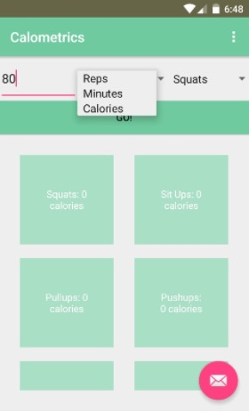
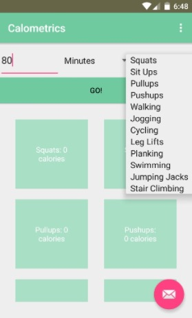

#
Calometrics

Calometrics is an Android application that allows users to input the amount of time they have for a workout, and see how many calories different types of exercise will burn in the allotted time. Users can also input calories, and see how much of each exercise they have to do in order to burn off the amount.

## Authors

Sreesha Venkat ([sreeshavenkat@berkeley.edu](mailto:sreeshavenkat@berkeley.edu))

## Demo Video

See Calometrics here: https://www.youtube.com/watch?v=Foa0WHqo_18&feature=youtu.be

## Screenshots

